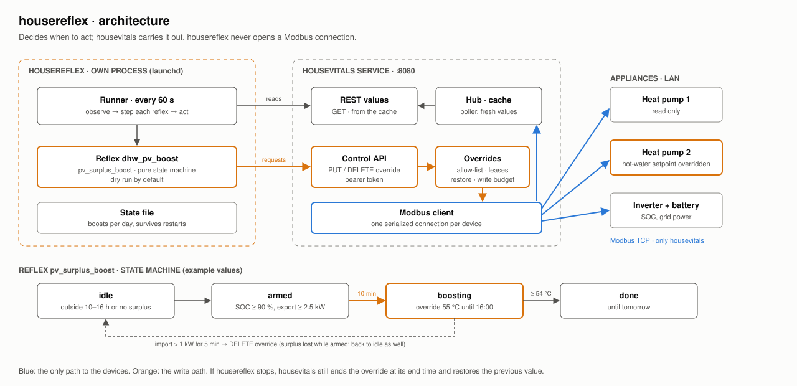

# housereflexes

**housereflexes is an open-source response and orchestration layer for residential vital systems.**

It connects vital data with rules and actions, enabling systems to respond to changing conditions.

The service (MIT) reacts automatically to the state of a house's energy system. Its
first reflex turns PV surplus into hot water: when the battery is full and power is
flowing into the grid, it raises a heat pump's hot-water setpoint for a while, so the
surplus is stored as heat instead of being exported.

It is the acting counterpart to [housevitals](https://github.com/isachse/housevitals-mcp),
which measures. housereflexes never talks to a device: it reads live values from
housevitals and asks housevitals for **overrides**, which housevitals checks, writes
through its single Modbus connection per device, and undoes when they end.



## Why a separate service

* **One Modbus client.** Heat pump gateways often accept only one TCP connection.
  housevitals already holds it, with a lock per device; a second client would compete
  with it. housereflexes only uses HTTP.
* **Deciding vs. doing.** housevitals is a generic data layer with a guarded write path
  (allow-list, bounds, time limit, write budget, automatic restore). The rules for when
  to act are specific to a house and belong here.
* **Fails safe.** Every override has an end time held by housevitals. If housereflexes
  crashes or is stopped, housevitals still ends the override and restores the previous
  value. If housevitals is down, housereflexes pauses.

## Reflexes

### `pv_surplus_boost`

Raises a setpoint while there is sustained PV surplus. There is no start window:
surplus itself means daylight. Only the end is bounded.

| Phase | Enters when | Does |
|-------|-------------|------|
| `idle` | no surplus, the tank is already hot, today's limit is reached, or less than `boost.min_duration_s` left before `boost.latest_end` | nothing |
| `armed` | battery ≥ `min_battery_soc` and export ≥ `min_export_w` | waits until the surplus has held for `arm.hold_s` without interruption |
| `boosting` | surplus held long enough | `PUT` override with the target value; it ends at whichever comes first: `boost.max_duration_s` after the start or `boost.latest_end` |
| `done` | `done.key` ≥ `done.min` (e.g. tank hot), the end time is reached, or the override ended in housevitals | `DELETE` override (restores the previous value); nothing more today |

The end time is also the override's end in housevitals, so the heat pump returns to
normal even if housereflexes stops. Example: surplus confirmed at 11:10 → boost until
14:10 (3 h); confirmed at 16:10 → until 18:00; at 17:40 → no boost (less than 30 min).

While boosting, the reflex watches the **deficit**: grid import plus battery discharge.
If the house draws more than `abort.max_deficit_w` from both together for
`abort.hold_s` (clouds, dusk), the override ends as well; the reflex may arm again if
`max_per_day` allows. Counting the battery matters: when PV drops, the battery covers the
heat pump and grid import stays near zero, so an import limit alone would heat the tank
from the battery. Values that are
stale or unavailable never count as surplus. A running override is recognized after a
restart (by its owner `housereflexes/<name>`), and the number of boosts per day is kept in
the state file.

Example for a BLW NEO heat pump: the controller keeps the hot water at the normal
setpoint during its time program and at the minimum setpoint (e.g. 42 °C) otherwise.
Overriding `dhw_setpoint_min` with 55 °C makes it heat right away, whatever the time
program says; afterwards the minimum is back at 42 °C. Pick a target clearly above the
tank's usual temperature (and the `done` threshold just below the target), otherwise a
tank heated in the morning already counts as "hot" and the surplus is not used. The heat pump's own time program
stays the fallback.

## Installation

Requires Python ≥ 3.11 and a running housevitals with the control API enabled.

```bash
python3 -m venv .venv
.venv/bin/pip install -e .
```

## Configuration

### housevitals

Allow-list the register in housevitals' `devices.json` and give it a control token
(see its README, section "Control API"):

```json
{ "name": "heatpump2", "profile": "neo", "host": "…",
  "overrides": { "dhw_setpoint_min": { "min": 40, "max": 55, "max_duration_s": 21600 } } }
```

housevitals' `max_duration_s` must be at least the reflex's `boost.max_duration_s` (3 h by default).

### housereflexes

Copy [reflexes.example.json](reflexes.example.json) to `reflexes.json` (ignored by git)
and adjust names and thresholds:

| Option | Default | Description |
|--------|---------|-------------|
| `housevitals.url` | `http://127.0.0.1:8080` | housevitals service |
| `housevitals.token_file` | – | File with the control token (or env `HOUSEREFLEXES_TOKEN`); on the same host this is housevitals' token file |
| `timezone` | `Europe/Berlin` | `latest_end` and days |
| `interval_s` | `60` | Seconds between rounds (≥ 10) |
| `status_interval_s` | `1800` | A status line per reflex this often (`0`: only phase changes) |
| `dry_run` | `true` | Only log what would be done; `--live` or `false` to act |
| `state_file` | `~/.local/state/housereflexes/state.json` | Boosts per day |
| `owner_prefix` | `housereflexes` | Owner shown in housevitals: `<prefix>/<reflex name>` |

Per reflex (`type: pv_surplus_boost`):

| Option | Default | Description |
|--------|---------|-------------|
| `name` | – | Unique name (letters, digits, `_`) |
| `enabled` | `true` | |
| `target` | – | `appliance`, `key`, `value` of the override (names or aliases as in housevitals) |
| `boost` | 3 h, 30 min, `18:00` | `max_duration_s`: longest boost; `min_duration_s`: no start if less time is left before `latest_end`; `latest_end`: local time a boost ends at the latest |
| `source` | – | `appliance` with the battery and meter (the inverter); keys `battery_soc`, `grid_power` (positive = import), `battery_power` (positive = discharging) |
| `arm` | 90 %, 2500 W, 600 s | `min_battery_soc`, `min_export_w`, `hold_s` |
| `done` | – | `appliance`, `key`, `min`: end early when reached (e.g. `dhw_temperature` ≥ 54) |
| `abort` | 500 W, 300 s | `max_deficit_w` (grid import + battery discharge), `hold_s` |
| `max_per_day` | `1` | Boosts per day |

Two enabled reflexes may not override the same register.

## Running

Try it once; this prints what each reflex sees and would do:

```bash
.venv/bin/housereflexes --config reflexes.json --once --dry-run
```

Run in dry-run mode for a few days and read the log; then set `"dry_run": false` (or pass
`--live`).

As a LaunchAgent ([deploy/local.housereflexes.plist](deploy/local.housereflexes.plist)),
filling in the paths from the project directory:

```bash
sed -e "s#__PROJECT_DIR__#$PWD#g" -e "s#__HOME__#$HOME#g" deploy/local.housereflexes.plist > ~/Library/LaunchAgents/local.housereflexes.plist
```

```bash
launchctl bootstrap gui/$(id -u) ~/Library/LaunchAgents/local.housereflexes.plist
```

Restart after config changes:

```bash
launchctl kickstart -k gui/$(id -u)/local.housereflexes
```

Logs go to `~/Library/Logs/housereflexes.log`: one line per phase change and per action,
and a status line every 30 min naming the condition that holds a reflex back, e.g.
`dhw_pv_boost: idle: 30 min left before 18:00 (yes), battery 96 % >= 90 % (yes), export 7700 W >= 2500 W (yes), dhw_temperature 49.3 < 54 (yes), boosts today 0/1`;
while boosting: `boosting: until 14:10, deficit -1200 W <= 500 W (yes), …`.
Overrides show up in housevitals: `GET /api/v1/overrides`, its log, and the metric
`housevitals_override_active{owner="housereflexes/…"}` for Grafana.

## Privacy

The repository contains no addresses, tokens or house data. `reflexes.json`, token
files and the state file stay local (`.gitignore`, state under `~/.local/state`).
Tokens are read from a file or an environment variable, never from the config file.

## Code structure

| Module | Responsibility |
|--------|----------------|
| `config.py` | Configuration, validation, token |
| `client.py` | housevitals REST client (values, overrides) |
| `reflexes.py` | Reflex state machines, pure and without I/O |
| `runner.py` | Loop: observe, step, act; state file |
| `cli.py` | Command line `housereflexes` |

## Development

```bash
.venv/bin/pip install -e ".[dev]"
.venv/bin/pytest
```

The tests use a fake housevitals API; no service or hardware is needed.
